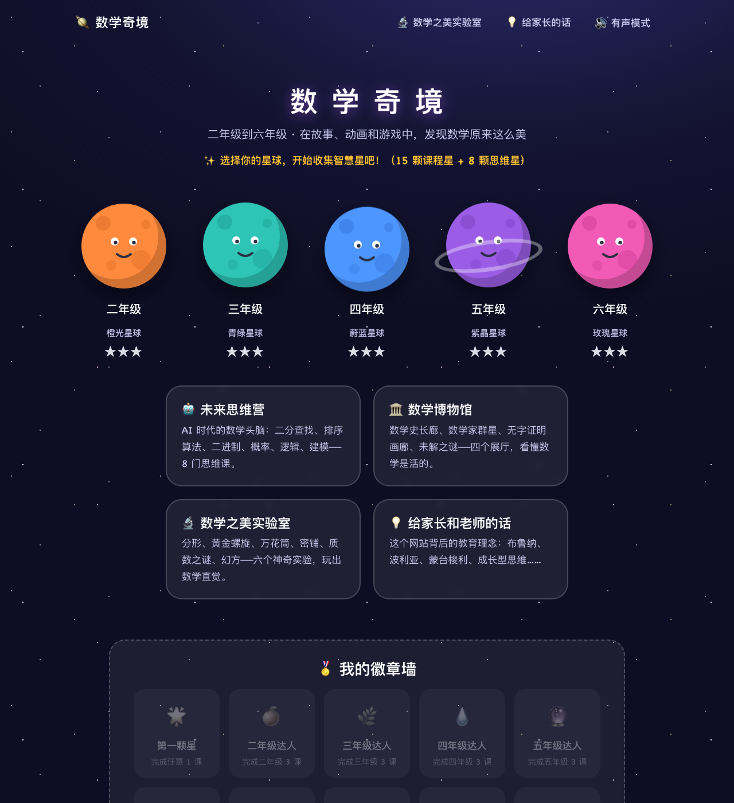
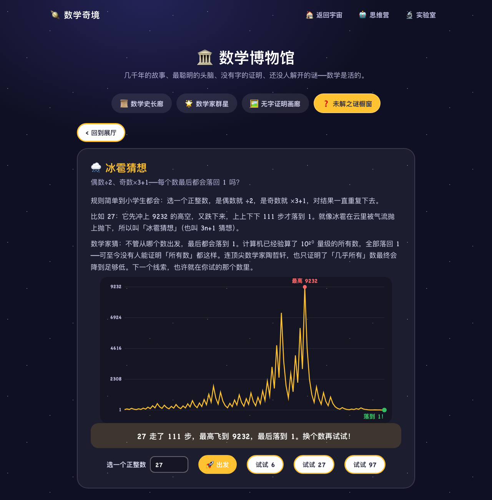

# 🪐 数学奇境 Math Wonderland

> 让二到六年级的孩子，在故事、动画和游戏中发现数学之美——一个免费、开源、零追踪的公益学习网站。

**在线体验 → https://math.liaomagic.com**



## 为什么做这个项目

计算器会算，AI 会解题，但「数学头脑」无法外包。数学奇境想让每个孩子真心觉得——**数学真美，数学真好玩**。

它的每一课都站在教育学家的肩膀上：

- **布鲁纳**《教育过程》：任何知识都能以孩子能懂的方式呈现——每课按「动手操作 → 图像动画 → 符号表达」三重表征展开
- **波利亚**《怎样解题》：解题第四步「回顾」——每课都有一题多解与「讲给爸爸妈妈听」
- **蒙台梭利**：先有具象操作，后有抽象符号——方块、方格、分数条、量角器都是可交互教具
- **德韦克**：成长型思维——夸过程不夸聪明，答错给提示再来一次，无扣分、无倒计时、无排名
- **比约克**：间隔复习——每课闯关含「温故题」，错题自动进错题本
- **乔·博勒**《这才是数学》：低门槛高天花板，先探索后讲授
- **洛克哈特**《一个数学家的叹息》：数学是艺术——所以有一座「数学博物馆」

## 里面有什么

| 板块 | 内容 |
|---|---|
| 🪐 年级课程 | 二~六年级各 8 个单元（对齐人教版目录），每课 7 幕完整学习闭环 |
| 🤖 未来思维营 | 8 门 AI 时代思维课：二分查找、排序、二进制、概率、逻辑、建模、统筹法、密码 |
| 🏛️ 数学博物馆 | 四展厅 20 件展品：数学史、数学家（割圆术/优选法可互动）、无字证明、未解之谜 |
| 🔬 数学之美实验室 | 分形树、黄金螺旋、万花筒、密铺、质数螺旋、幻方 |
| ⚡ 口算天天练 | 按年级自动出题，错题自动收录 |
| 📒 错题本 | 答错的题自动收集，重做答对即毕业 |

## 一分钟跑起来

零依赖、零构建——不需要 Node、不需要 npm install：

```bash
git clone https://github.com/raymondjxj/math-wonderland.git
cd math-wonderland
# 直接双击 index.html 即可；或起个本地服务：
python3 -m http.server 8000
# 打开 http://localhost:8000
```

## 部署

任何静态托管都能放（GitHub Pages / Cloudflare Pages / Vercel / 学校内网服务器）。本仓库的线上版用 Cloudflare Pages：

```bash
npx wrangler pages deploy . --project-name=math-wonderland --branch=main
```

## 参与贡献

我们特别欢迎：**一线教师**（审校课程、提教学建议）、**家长**（反馈孩子的真实使用体验）、**设计师**（插画与动效）、**工程师**（引擎与教具）。

- 🐛 [提 Bug](https://github.com/raymondjxj/math-wonderland/issues/new?template=bug.md)
- 💡 [提想法](https://github.com/raymondjxj/math-wonderland/issues/new?template=idea.md)
- 📖 写新课程：内容是纯数据文件，照 [`content/README.md`](content/README.md) 的格式加单元即可，引擎自动渲染
- 开始之前请读 [CONTRIBUTING.md](CONTRIBUTING.md)

内容质量有自动守门员：

```bash
node tools/validate.js          # 校验全部课程结构
node tools/check-ext.js <file>  # 校验扩展单元文件
```

## 隐私

**零账号、零 Cookie、零追踪、零广告。** 学习进度只存在孩子自己设备的 localStorage 里，可用「进度导出码」跨设备转移。详见[隐私说明](privacy.html)。

## 许可证

- 代码：[MIT](LICENSE-CODE)
- 课程内容：[CC BY-SA 4.0](LICENSE-CONTENT)（署名-相同方式共享）

## 截图

| 博物馆·冰雹猜想 | 实验室·幻方 | 课程·负数 |
|---|---|---|
|  |  |  |
